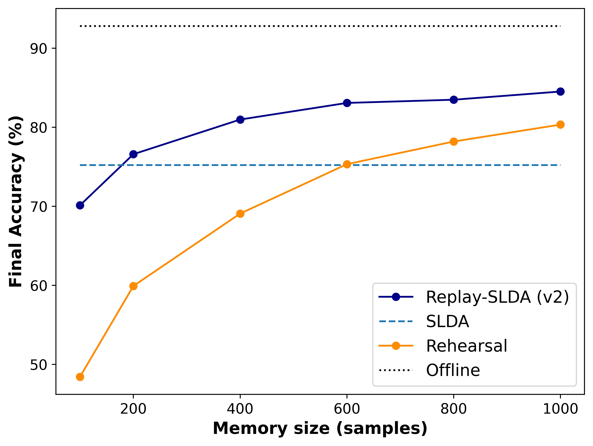
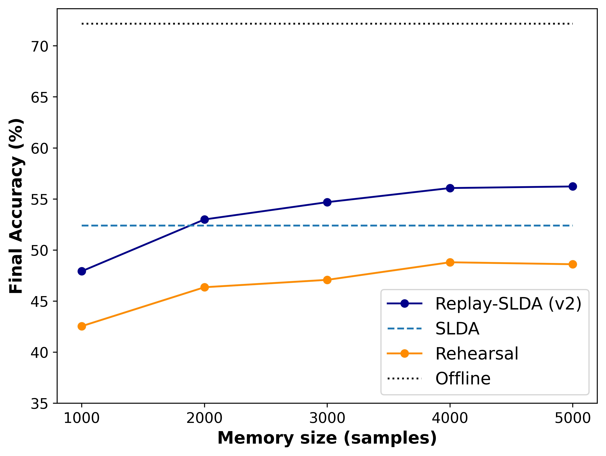
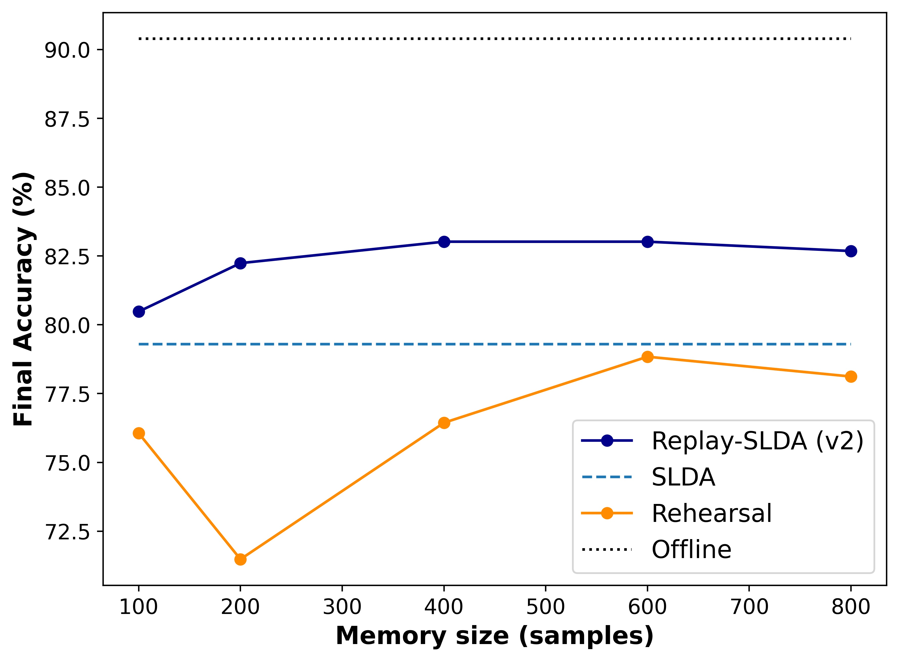

# Combining Rehearsal with Linear Discriminant Analysis in Online Continual Learning
This is a PyTorch implementation of the Replay-SLDA algorithm developed for my master's thesis. It is an extension of previous work by [Hayes and Kanan (2020)](https://openaccess.thecvf.com/content_CVPRW_2020/html/w15/Hayes_Lifelong_Machine_Learning_With_Deep_Streaming_Linear_Discriminant_Analysis_CVPRW_2020_paper.html) on Deep Streaming Linear Discriminant Analysis (SLDA). Replay-SLDA alleviates the requirement for a pre-trained and frozen feature extractor, allowing the network to learn new feature representations. The algorithm uses rehearsal to continually train the feature extractor while updating the classification layer through linear discriminant analysis. The code here contains the final implementation of the model, referred to as Replay-SLDA (v2) in the main text. This model was tested on [CIFAR-10, CIFAR-100 ](https://www.cs.toronto.edu/~kriz/cifar.html) (Krizhevsky and Hinton, 2009) and on [Histology(CRH)](https://www.nature.com/articles/srep27988) (Kather
et al., 2016) datasets. In all three, it achieved higher final accuracy compared to SLDA already from memory sizes corresponding on average to 20 samples per class.
## Environments
- Python=3.9.2
- PyTorch=1.8.1
- Torchvision=0.9.1
- NumPy=1.22.4
## Usage
Set up relevent parameters in main.py and run the file. Different training algorithms can be selected from training.py file. Examples on how to use each training algorithm are shown below:

To use rehearsal training, simply create a ResNet-18 model using resNet18_model function and pass it as an argument to the training algorithm. The code has been implemented with a ResNet-18 CNN but different architectures could be used as well.
```
model = resNet18_model(output_classes)
rehearsal_train(model, trainset,...)

```
The slda_train  algorithm accepts an SLDA model for training. This must be created from a CNN model as follows:
```
model = resNet18_model(output_classes)
slda_model = SLDA(model)
slda_train(slda_model, trainset,...)

```
The Replay-SLDA algorithm accepts a CNN model as input and returns the final SLDA model.
```
model = resNet18_model(output_classes)
slda_model = replay_slda_v2(model, trainset,...)

```
## Results on CIFAR-10 


## Results on CIFAR-100 


## Results on CRH 


## References
Hayes, T. L. and Kanan, C. (2020). Lifelong machine learning with deep streaming
linear discriminant analysis. In Proceedings of the IEEE/CVF Conference on
Computer Vision and Pattern Recognition Workshops, pages 220–221.

Kather, J. N., Weis, C.-A., Bianconi, F., Melchers, S. M., Schad, L. R., Gaiser, T.,
Marx, A., and Z”ollner, F. G. (2016). Multi-class texture analysis in colorectal
cancer histology. Scientific Reports, 6:27988.

Krizhevsky, A. and Hinton, G. (2009). Learning multiple layers of features from tiny
images.


