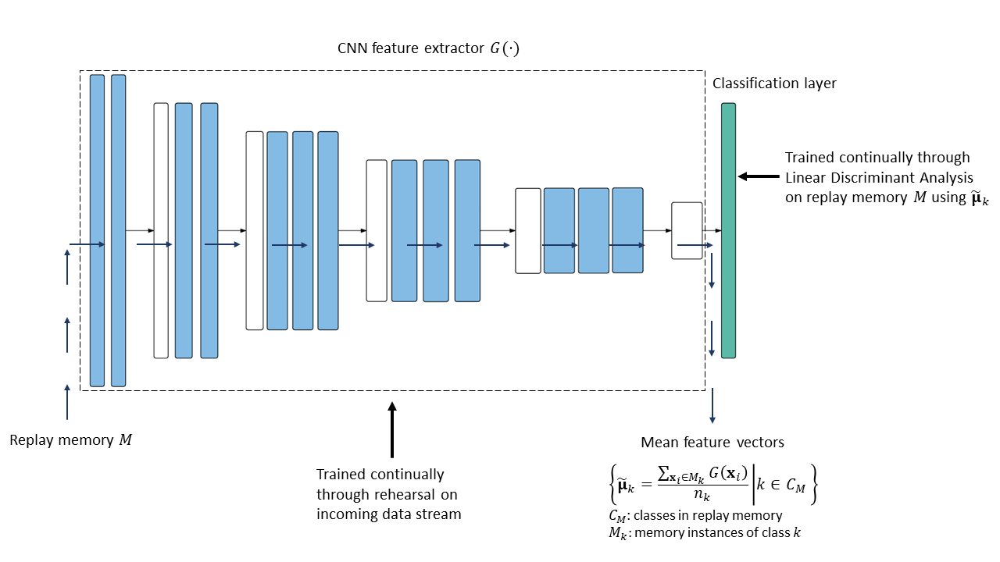

# Combining Rehearsal with Linear Discriminant Analysis in Online Continual Learning
This is a PyTorch implementation of the Replay-SLDA algorithm developed for my master's thesis. It is an extension of previous work by [Hayes and Kanan (2020)](https://openaccess.thecvf.com/content_CVPRW_2020/html/w15/Hayes_Lifelong_Machine_Learning_With_Deep_Streaming_Linear_Discriminant_Analysis_CVPRW_2020_paper.html) on Deep Streaming Linear Discriminant Analysis (SLDA). Replay-SLDA alleviates the requirement for a pre-trained and frozen feature extractor, allowing the network to learn new feature representations. It utilizes rehearsal to continually train the feature extractor while continually updating the classification layer through linear discriminant analysis. The uploaded code contains the final implementation of the model, referred to as Replay-SLDA (v2) in the thesis text. The model was trained and evaluated on [CIFAR-10, CIFAR-100 ](https://www.cs.toronto.edu/~kriz/cifar.html) (Krizhevsky and Hinton, 2009) and on [Histology(CRH)](https://www.nature.com/articles/srep27988) (Kather
et al., 2016) datasets. In all three, it achieved higher final accuracy than the original SLDA algorithm for memory sizes corresponding to 20 samples per class and above.

<p align="center">
  
</p>

## Usage

```commandline
usage: main.py [-h] [--train_alg {rehearsal,slda,replay-slda}] [--dataset {cifar10,cifar100,crh}] [--lr LR]
               [--batch_size BATCH_SIZE] [--batch_loops BATCH_LOOPS] [--max_samples MAX_SAMPLES]
               [--replay_size REPLAY_SIZE] [--print_interval PRINT_INTERVAL] [--save_model]

optional arguments:
  -h, --help            show this help message and exit
  --train_alg {rehearsal,slda,replay-slda}
                        training algorithm
  --dataset {cifar10,cifar100,crh}
                        image dataset
  --lr LR               learning rate for SGD
  --batch_size BATCH_SIZE
                        number of samples in the batch
  --batch_loops BATCH_LOOPS
                        number of times to iterate on a given batch
  --max_samples MAX_SAMPLES
                        number of samples stored for replay
  --replay_size REPLAY_SIZE
                        size of batch replayed from memory
  --print_interval PRINT_INTERVAL
                        print training info at specified intervals of the dataset size
  --save_model          save trained model
```
Note: The slda algorithm does not require any training parameters, it can be run simply as
```
python main.py --train_alg slda --dataset cifar10
```
The training parameters can be optionally specified for rehearsal and replay-slda algorithms, otherwise defaults values are used. An example would be
```
python main.py --train_alg replay-slda --dataset cifar10 --lr 1e-3 --batch_size 10 --max_samples 600 --replay_size 10
```

## Environments
- Python=3.9.2
- PyTorch=1.8.1/1.12.1
- Torchvision=0.9.1/0.13.1
- NumPy=1.22.4

## Results
The following plots show the comparison of the Replay-SLDA algorithm to the original SLDA and Rhearsal algorithms for three different datasets. The performance of the offline model is also included which refers to conventional non-continual training.
### Evaluation on CIFAR-10 


### Evaluation on CIFAR-100 


### Evaluation on CRH 


## References
Hayes, T. L. and Kanan, C. (2020). Lifelong machine learning with deep streaming
linear discriminant analysis. In Proceedings of the IEEE/CVF Conference on
Computer Vision and Pattern Recognition Workshops, pages 220–221.

Kather, J. N., Weis, C.-A., Bianconi, F., Melchers, S. M., Schad, L. R., Gaiser, T.,
Marx, A., and Z”ollner, F. G. (2016). Multi-class texture analysis in colorectal
cancer histology. Scientific Reports, 6:27988.

Krizhevsky, A. and Hinton, G. (2009). Learning multiple layers of features from tiny
images.


